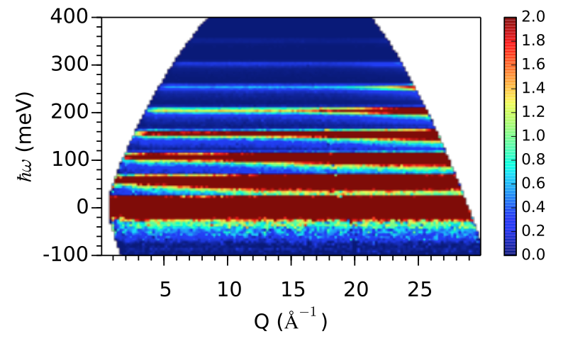
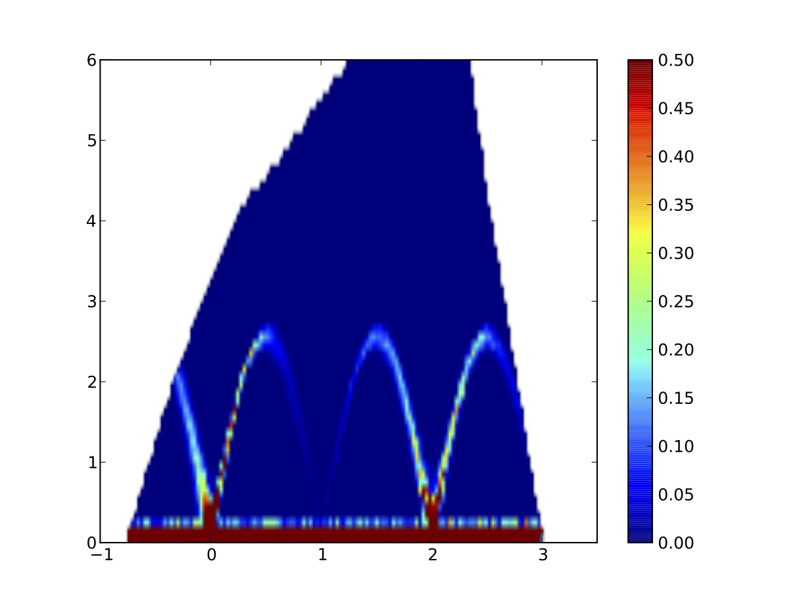
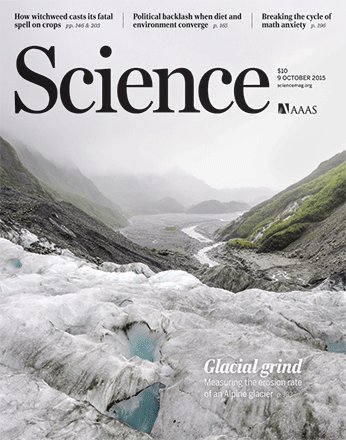

.. _research:

Research
========

Analysis of Inelastic Neutron Scattering Data
---------------------------------------------

In neutron scattering experiments,
phenomena such as multi-phonon scattering
and multiple-scattering
can subtly influence the measured spectra.
End-to-end Monte-Carlo neutron ray-tracing simualtions
using the 
`MCViNE <http://docs.danse.us/MCViNE>`_ 
software
can take into account much more details that matter
to the measurements than traditional data analysis methods,
take advantage of ever-increasing computing power,
and help us gain better insight into how different
scattering mechanisms give rise to different features
in the neutron spectra.

   I(Q,E) spectra from a MCViNE simulation. 
   See `The Uranium Nitride study <http://dx.doi.org/10.1103/PhysRevB.89.144302>`_

The resolution in spectra of 
dynamical structure factor measured
by inelastic neutron scattering
has been difficult to quantify
and it can lead to sub-optimal analysis.
This is especially true for single-crystal measurements
where the spectra is 4-dimensional.
MCViNE simulations can accurately compute resolution
functions, which vary for different instruments, 
different experimental conditions, as well as
different locations in the 4-D **Q**,E space.

   I(h,E) slice of KVO HYSPEC data. Note the strong
   focusing effect in the two spin-wave branches stemming 
   from (010).

`The VNFatSNS project <http://docs.danse.us/VNET/VNFatSNS>`_
is attacking both problems
by using the
`MCViNE <http://docs.danse.us/MCViNE>`_ 
software package.

Measuring ground deformation using optical satellite and aerial images
----------------------------------------------------------------------

We are developing techniques for 
accurate satellite image correlation and registration,
and DEM extraction by stereo imaging. See
`COSI-Corr <http://www.tectonics.caltech.edu/slip_history/spot_coseis/>`_

Our work contributed to a recent cover paper in the journal *Science*:

   Source: https://www.sciencemag.org/content/350/6257.cover-expansion

We are putting our technique into practical use
at `Imagin'Labs <http://www.imaginlabs.com>`_,
which was in a 
`startup report <http://thedishdaily.com/2012/11/16/caltech-startup-imagin-labs-provides-hyper-accurate-satellite-image-analysis/>`_.
